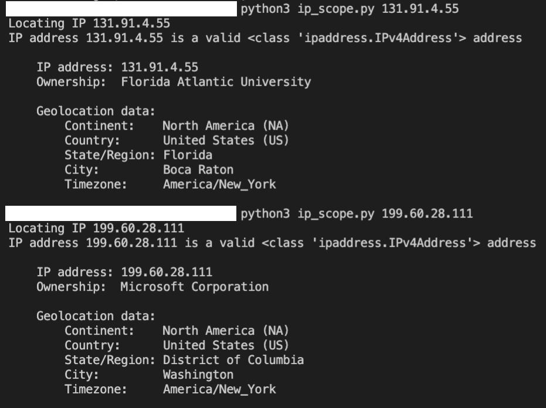

<div align="center">
    <hi>Project 1 - The Scope!</h1>
    <h2>A Python script for finding geolocation and owndership of an IP Addess/list of IP Addresses/CIDR</h2>
</div>

<div>
<p>
Scenario: Congrats, your Penetration testing company Red Planet has landed an external assessment for Microsoft! Your point of contact has give you a few IP addresses for you to test. Like with any test you should always verify the scope given to you to make sure there wasn't a mistake.

Beginner Task: Write a script that will have the user input an IP address. The script should output the ownership and geolocation of the IP. The output should be presented in a way that is clean and organized in order to be added to your report.

Intermediate Task:  Have the script read multiple IP addresses from a text file and process them all at once.

Expert Task:Have the script read from a file containing both single IP addresses and CIDR notation, having it process it both types.

Here are your IP addresses to check:
131.253.12.5
131.91.4.55
192.224.113.15
199.60.28.111

For the Expert Task here are two networks in CIDR notation:
20.128.0.0/16
208.76.44.0/22
</p>

</div>

<h2>Usage:</h2>
```sh
python3 ip_scope.py -h
```
<h2>Example command:</h2>
```sh
python3 ip_scope.py 131.91.4.55
```
<div>
<h2>Example outputs:</h2>

</div>